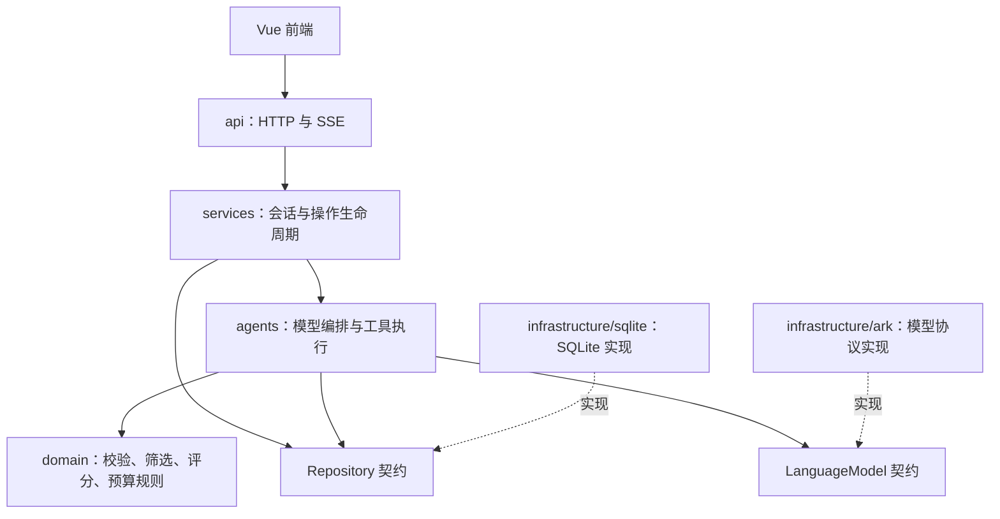

# 后端分层说明

后端按职责拆分：接口处理请求，服务管理一次操作的生命周期，Agent 决定如何使用模型与工具，业务规则决定哪些结果有效，基础设施负责连接模型服务和 SQLite。这样修改提示词、评分规则或存储方式时，可以找到明确的位置，也能在没有真实密钥的情况下测试。

运行方法在仓库根目录 [README](../README.md)；Agent 的具体流程在 [agents/README](agents/README.md)。

## 一次请求如何经过这些层



图中业务和 Agent 使用能力契约。`bootstrap.py` 将具体模型客户端和 SQLite 仓库注入这些对象；它是装配点，允许同时认识内层逻辑与外层实现。

## 各层的职责

| 位置 | 负责什么 | 不应放什么 |
| --- | --- | --- |
| `main.py` | `create_app`、异常映射、启动和关闭客户端、挂载路由 | 提示词、评分、SQL |
| `bootstrap.py` | 创建客户端、仓库、Agent、服务并连接依赖 | 业务判断与请求处理 |
| `api/` | 获取应用服务、接收请求、将事件编码为 SSE | 模型调用、业务计算、数据库事务 |
| `services/` | 创建与读取会话、并发控制、请求幂等、结果持久化 | 具体模型协议、HTTP 状态码、SQL |
| `agents/` | 画像、匹配工具循环、约会协作、可展示的结果与卡片 | FastAPI、HTTPX、SQLite、直接读取密钥 |
| `domain/` | 数据校验、纯业务函数、异常、事件结构和依赖契约 | Web 框架、网络调用、读写数据库 |
| `infrastructure/` | HTTPX 模型协议适配、SQLite 读写、虚构数据初始化 | 页面流程与 Agent 选择策略 |
| `core/config.py` | 读取并校验 YAML，保护密钥，解析本地路径 | 会话和推荐逻辑 |

这是单进程、本地单用户课设，没有引入消息队列、ORM 或额外 Agent 框架。基础设施目前只有一个模型适配器和一个仓库实现，契约也只定义项目实际使用的能力。

## 关键文件

```text
api/routes.py                6 个公开接口，转交服务处理
api/streaming.py             字典事件 → SSE；中断、模型错误的响应处理
services/sessions.py         会话创建、读取、串行、重试幂等与完整提交
services/dating.py           约会候选校验、完成结果保存、最近约会恢复
services/legacy.py           旧分析接口的兼容保存流程
agents/                      详见其中 README
domain/schemas.py           用户输入、筛选条件、模型结果的数据结构
domain/matching.py          本地筛选、排序、共同点和差异
domain/dating.py            活动可用性、预算校验、时间线和频率冲突
domain/catalog.py           预设活动与费用
domain/ports.py             LanguageModel / Repository 契约
domain/events.py            框架无关的业务事件
domain/errors.py            NotFound / Conflict / InvalidInput / ModelError
infrastructure/ark.py        Chat Completions 请求、工具分片拼接、JSON 校验、重试
infrastructure/sqlite.py     数据库连接、候选读取、会话保存与读取
infrastructure/seed.py       1,200 位来自 datasets/candidates.json 的虚构人物
```

## 如何装配与启动

`python -m backend` 读取端口并启动 Uvicorn。`main.py` 导出的 `app` 由 `create_app()` 创建；此时只注册接口，不读取真实 YAML、不打开数据库、不创建模型客户端。

服务启动时进入 FastAPI lifespan：加载 `Settings`，调用 `build_services`，把整组依赖放入 `app.state.services`。接口通过依赖注入取得这组对象。服务关闭时调用模型客户端的 `aclose()`；SQLite 每次操作都独立打开并关闭连接。

测试可以显式调用 `create_app(settings, repository, model)`，使用临时数据库与测试模型。依赖由工厂传入，不再修改模块级真实 `store` 或 `ark` 对象。配置文件仍在仓库根目录，移动配置模块不影响 YAML 和数据库的相对路径。

## 状态与错误放在哪里

对话服务先读取会话副本，校验请求编号、候选版本和当前会话是否繁忙，再将副本交给匹配 Agent。Agent 输出字典事件并修改副本。正常结束才保存整轮；异常或取消时丢弃修改并释放会话占用。取消会沿服务、Agent 到模型请求传播，逐层关闭流。

约会服务确认所选对象后调用约会 Agent。结构化行程可先显示，说明文字完整完成后才保存约会结果。若同时有只读聊天完成，会话提交保留同一候选版本下新写入的约会结果。

内层抛出 `NotFound`、`Conflict`、`InvalidInput`，由应用入口映射成 404、409、422。流开始后的脱敏模型错误由 SSE 适配器发送 `error`；未知错误使用统一提示，不回传异常栈或服务商原始响应。

## 想修改功能时从哪里开始

| 想改什么 | 主要修改位置 |
| --- | --- |
| 匹配 Agent 回复方式、调用习惯 | `agents/prompts.py` |
| 增加一个模型工具 | `agents/definitions.py` + `agents/tools.py`；纯计算放入 `domain/` |
| 匹配条件、评分、共同点 | `domain/schemas.py` + `domain/matching.py` |
| 约会菜单或预算逻辑 | `domain/catalog.py` + `domain/dating.py` |
| 工具结果渲染成新卡片 | `agents/cards.py` 及前端 `AgentCard.vue` |
| 会话重试、保存规则 | `services/sessions.py` |
| 更换模型供应商或存储实现 | 实现 `domain/ports.py` 契约，并在 `bootstrap.py` 装配 |
| 增加接口 | `api/routes.py`，调用已有或新增服务 |

## 兼容与验证

当前 `/api/health`、会话接口、约会接口及 SSE 字段保持兼容，SQLite 表结构和历史会话格式保持不变，无需迁移本地数据。旧 `/api/analyze` 保留在独立的 legacy Agent 与服务中，接口文档标为 deprecated，当前前端不调用。

后端回归覆盖多轮工具调用、卡片与筛选、取消回滚、并发、幂等、约会预算及恢复。新增分层检查禁止内层引入 FastAPI、HTTPX、SQLite 或反向依赖；生命周期检查验证工厂无启动副作用，以及启动和关闭资源。命令见根目录 README。
