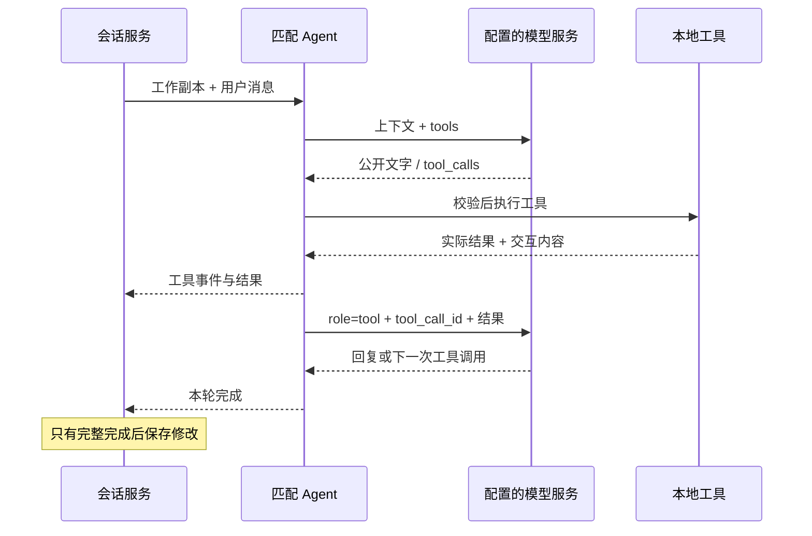

# Agent 是怎么实现的

缘析使用豆包 Pro 的原生 Function Calling。匹配 Agent 读懂用户要求后，选择预先定义的工具；本地代码执行工具，把结果回传给模型，并同时生成前端可交互内容。它可以连续处理多轮聊天，但筛选、分数、预算和确认对象都受程序约束。

这层只依赖模型能力契约、业务规则和查询能力，不包含 FastAPI 路由、HTTPX 请求或 SQLite 操作。HTTP 和数据库分别由外层适配器与服务负责，整体结构见 [后端分层说明](../README.md)。

## 先看这几个文件

| 文件 | 作用 |
| --- | --- |
| `matching.py` | 多轮匹配 Agent：拼接上下文、调用模型、执行工具、记录公开消息。 |
| `profile.py` | 画像 Agent：将完整个人资料整理为结构化画像。 |
| `dating.py` | 约会 Agent：选择活动，调用预算和时间规则，并生成协作反馈。 |
| `prompts.py` | 匹配助手的角色、合法筛选行为和能力边界。 |
| `definitions.py` | 给模型看的工具名称、说明和 JSON Schema。 |
| `tools.py` | 工具白名单执行，调用画像 Agent 或业务规则，更新本轮上下文。 |
| `cards.py` | 把工具结果映射成允许的前端卡片。 |
| `legacy.py` | 保留旧固定分析流程，当前聊天产品不走这里。 |

## 一轮聊天怎样完成

以“只看杭州同城，24 到 29 岁”为例：

1. 会话服务校验请求并复制当前会话，把工作副本交给 `MatchingAgent.run`。
2. Agent 把系统规则、当前资料、筛选条件、已选对象、候选和已完成的消息历史发给模型。
3. 模型可以先输出一句简短行动说明，然后返回 `update_preferences` 的工具调用。
4. 工具执行器校验参数，将城市和年龄写入副本，保留未提及条件，并输出条件变更内容。
5. 工具结果以对应的 `tool_call_id` 回传模型；模型再调用 `search_candidates`，从本地 1,200 人中筛选和排序。
6. 本地返回最多 3 位真实存在于样本库中的候选，生成候选交互内容；模型再基于这些结果回复建议。
7. 模型正常结束后，会话服务保存整轮消息、工具记录和更新后的上下文，发送新的会话状态及 `done`。

模型最多进行 6 次工具循环，每次最多 5 个调用。一段会话最多 30 轮。模型没有无限循环、自主执行任意代码或访问任意网站的能力。

## 工具有哪些约束

| 工具 | 参数与效果 |
| --- | --- |
| `analyze_profile` | 无参数；首次分析个人资料后缓存画像。 |
| `update_preferences` | 接收 `patch`；支持城市、年龄、兴趣、频率和关系目标。未传字段保留，null 或空兴趣清除限制。 |
| `search_candidates` | 按当前条件检索，最多 3 人；`exclude_seen=true` 表示保持条件换一批。 |
| `compare_candidates` | 接收 2–3 位已经展示过的候选编号，不能编造新人物。 |

修改筛选或重新检索会递增推荐版本，清除旧选择和旧约会入口。没有结果时如实返回空结果，不自动放宽条件。

`select_candidate` 是用户点击动作对应的确认操作，没有放进模型可自主调用的工具清单。用户在前端点击选择，后端检查候选属于当前推荐、卡片版本一致，才写入 `selected_id` 并返回约会入口。这避免模型在一句建议里替用户做出确认。

## 三种 Agent 如何协作

**画像 Agent** 接收表单数据，调用模型得到关系类型、偏好摘要与可能需要商量的差异，结果经过 Pydantic 校验。它不做心理诊断或生成分数。

**匹配 Agent** 负责对话和工具决策。筛选、规则分、人物共同点与差异在 `domain/matching.py` 计算。模型解释这些结果，不能自由改写人物信息或数值。

**约会 Agent** 接收已确认的人物和用户填写的预算、时间、口味，从本地活动目录选择餐饮、活动和饮品。`domain/dating.py` 验证活动 ID、双方较低预算、时间线，以及见面频率冲突。若存在“每周 2–3 次”和“每月 1–2 次”的明显差异，再以匹配助手角色调用模型解释反馈；规则只修正一次 10 分，重复规划不累计扣分。

三者都是同一进程内的明确职责，通过同一个模型客户端调用外部模型，不需要独立服务、Agent 框架或本地模型。

## 流式文字与可操作结果

模型访问由 `LanguageModel` 契约承接，实际模型协议在 `infrastructure/ark.py`：

- 调用 `POST /chat/completions`，设置 `stream=true` 和工具定义。
- 按 `delta.tool_calls[index]` 拼接工具名称和参数；收到正常结束标记后才执行完整调用。
- 结果作为 `role=tool` 消息回传，保留对应 `tool_call_id`。
- 公开回复 `delta.content` 可以流式显示；内部 `reasoning_content` 不展示、不存储。默认关闭深度思考，公开行动摘要并非模型内部思维链。

Agent 向外只输出 Python 字典事件，例如 `delta`、`tool_start`、`tool_end`、`card`。服务层补充 `state` 和完成状态，API 层再编码为 SSE，前端处理增量文字与交互。

交互内容使用受控的 `component + props + revision` 协议，支持画像、条件、候选、比较、选择确认、空结果六类。这是轻量 A2UI 风格实现，不是完整 A2UI 标准；模型不能让浏览器执行任意 HTML、JavaScript 或未知组件。当前 UI 将大部分内容显示为摘要、人物行和折叠记录，协议不要求一定画成多层卡片。

## 出错、停止和重试

工具参数错误会生成错误结果回给模型，让它在本轮限制内纠正。模型连接失败、输出截断或用户停止时，异常向外传播；服务层不提交工作副本，释放会话占用，API 返回可展示的错误。前端保留未完成文字供阅读，但禁用本轮操作内容。

会话服务用 `request_id` 防止重复提交：相同编号、相同内容的已完成请求直接恢复状态；同编号不同内容返回冲突。同一段会话同时只允许一轮修改。旧卡片版本不匹配时不可选择。

模型服务限流和暂时故障由模型适配器在消费响应前有限重试；已经开始输出的流不自动重播。JSON 结构化结果最多重新生成一次，业务校验仍由本地规则完成。

## 怎样增加能力

增加一个工具时，先判断是否需要模型决策。确定性的计算写进 `domain/`；再在 `definitions.py` 定义工具名称、说明和参数，在 `tools.py` 接入执行。需要额外外部能力时先定义依赖契约，再提供适配器并通过 `bootstrap.py` 注入。

若要新增可点击结果，在 `cards.py` 增加受控类型，同时实现前端渲染与动作，并在服务层校验动作对应的会话状态。不要仅靠提示词约束敏感状态变化。

修改后运行根目录 README 中的后端测试。现有测试使用可控的模型回复检查完整工具往返、取消回滚、幂等、过期卡片、预算和恢复；不需要真实 Key。需要验证新模型协议时，再进行真实方舟联调。
